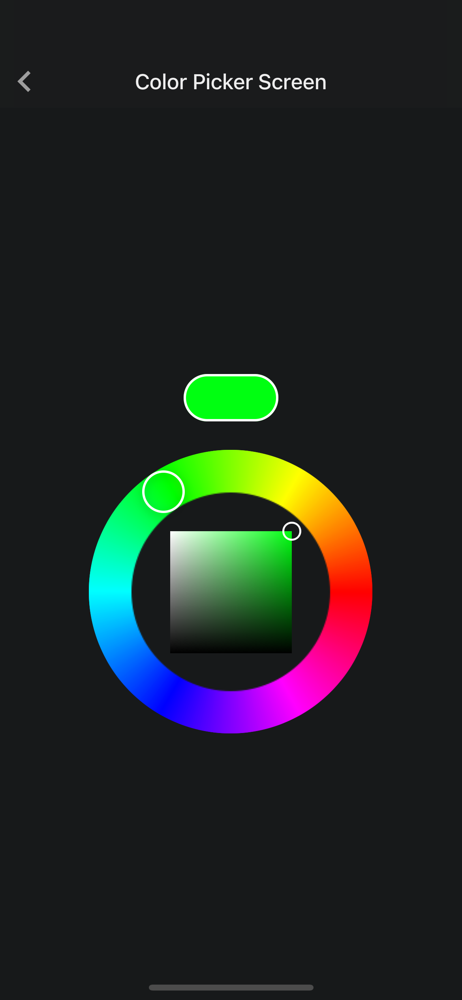

# @nghinv/react-native-color-picker

React Native Color Picker Library use reanimated 2

---

[](https://circleci.com/gh/nghinv-software/react-native-color-picker)
[![Version][version-badge]][package]
[![MIT License][license-badge]][license]
[![All Contributors][all-contributors-badge]][all-contributors]
[![PRs Welcome][prs-welcome-badge]][prs-welcome]

<p align="center">

</p>

## Installation

```sh
yarn add @nghinv/react-native-color-picker
```

or 

```sh
npm install @nghinv/react-native-color-picker
```

## Usage

```js
import React, { useState, useEffect } from 'react';
import { View, StyleSheet } from 'react-native';
import { useSharedValue } from 'react-native-reanimated';
import ColorPicker, { ColorAnimated } from '@nghinv/react-native-color-picker';
import { colors, useHsv } from '@nghinv/react-native-animated';

function App() {
  const [initialColor, setColor] = useState('#ffff55');
  const hsv = useHsv(0);
  const isGestureActive = useSharedValue(false);

  useEffect(() => {
    const hsvValue = colors.hex2Hsv(initialColor);
    hsv.h.value = hsvValue.h;
    hsv.s.value = hsvValue.s;
    hsv.v.value = hsvValue.v;
  }, [initialColor, hsv]);

  return (
    <View style={styles.container}>
      <ColorAnimated
        hsv={hsv}
        isGestureActive={isGestureActive}
        style={styles.currentColor}
      />
      <ColorPicker
        size={240}
        hsv={hsv}
        isGestureActive={isGestureActive}
        // initialColor={initialColor}
        // resetSaturationWhenHueChange
        onColorChange={(color) => {
          console.log('onColorChange', color);
        }}
        onColorConfirm={(color) => {
          console.log('onColorConfirm', color);
        }}
      />
      <Slider
        width={240}
        style={{ marginTop: 32 }}
        value={hsv.value.v}
        onChange={onChange}
      />
    </View>
  );
}

const styles = StyleSheet.create({
  container: {
    flex: 1,
    justifyContent: 'center',
    alignItems: 'center',
    paddingHorizontal: 16,
  },
  currentColor: {
    width: 80,
    height: 40,
    borderRadius: 20,
    marginBottom: 24,
    borderWidth: 2,
    borderColor: 'white',
  },
});

export default App;
```

# Property

| Property | Type | Default | Description |
|----------|:----:|:-------:|-------------|
| initialColor | `string` | `#ffffff` |  |
| size | `number` | `screen_width - 64` |  |
| strokeWidth | `number` | `36` |  |
| rectSizeSpace | `number` | `8` |  |
| disabled | `boolean` | `false` |  |
| onColorChange | `(color: string) => void` | `undefined` |  |
| onColorConfirm | `(color: string) => void` | `undefined` |  |
| hsv | `HsvAnimated` | `undefined` |  |
| isGestureActive | `Animated.SharedValue<boolean>` | `undefined` |  |
| resetSaturationWhenHueChange | `boolean` | `false` |  |

---
## Credits

- [@Nghi-NV](https://github.com/Nghi-NV)


[version-badge]: https://img.shields.io/npm/v/@nghinv/react-native-color-picker.svg?style=flat-square
[package]: https://www.npmjs.com/package/@nghinv/react-native-color-picker
[license-badge]: https://img.shields.io/npm/l/@nghinv/react-native-color-picker.svg?style=flat-square
[license]: https://opensource.org/licenses/MIT
[all-contributors-badge]: https://img.shields.io/badge/all_contributors-1-orange.svg?style=flat-square
[all-contributors]: #contributors
[prs-welcome-badge]: https://img.shields.io/badge/PRs-welcome-brightgreen.svg?style=flat-square
[prs-welcome]: http://makeapullrequest.com
